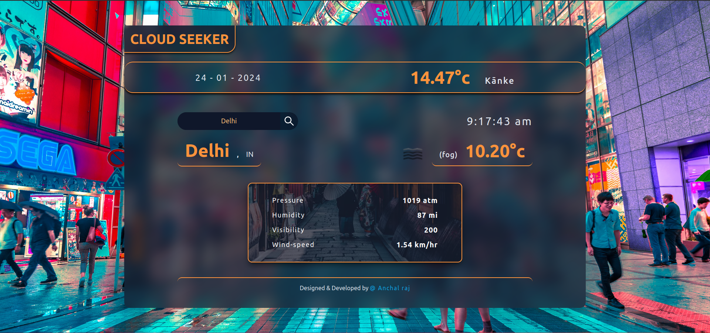

# Cloud Seeker

Welcome to the Cloudseeker, a simple and intuitive weather application developed using React and Tailwind CSS. This app fetches weather data from the OpenWeather API and presents it in a visually appealing and user-friendly interface. The Weather App has two main features: automatic location detection and search-based weather forecasts.

### [- - Deployed Link - -](https://cloudseeker.netlify.app/)


## Features

### 1. Automatic Location Detection

- The app uses the browser's geolocation API to request location permissions from the user.
- Once granted, it automatically detects the user's current location and displays the corresponding weather information.
- Users can choose to allow or deny location access.

### 2. Search-based Weather Forecasts

- Users can search for the weather forecast of any city by entering its name in the search bar.
- The app fetches real-time weather data from the OpenWeather API and provides a detailed forecast for the specified city.
- The forecast includes information such as temperature, humidity, wind speed, and more.

## Getting Started

To run the Weather App locally, follow these steps:

1. Clone this repository:
```bash
   git clone https://github.com/anchalraj31082004/cloudseeker.git
```

2. Navigate to the project directory:
```bash
    cd cloudseeker
```

3. Install the dependencies
```bash
    npm install
```

4. Visit the localhost URL
```bash
    http://localhost:5173
```

## Techonologies Used

* React: A JavaScript library for building user interfaces.
* Tailwind CSS: A utility-first CSS framework for quickly styling the app.
* OpenWeather API: Provides real-time weather data for accurate forecasts.

### thanks for visiting the repository, this was a dummy and practice project of my initial days of learing ReactJS, hope you liked it, you can also explore other repository in my account.